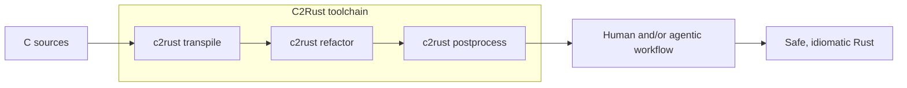

# C2Rust

[![ci GitHub Actions Status]][github] [![c2rust-testsuite GitHub Actions Status]][github] [![Latest Version]][crates.io] [![Rustc Version]](#)

[ci GitHub Actions Status]: https://github.com/immunant/c2rust/workflows/ci/badge.svg
[c2rust-testsuite GitHub Actions Status]: https://github.com/immunant/c2rust/workflows/c2rust-testsuite/badge.svg
[github]: https://github.com/immunant/c2rust/actions

[Latest Version]: https://img.shields.io/crates/v/c2rust.svg
[crates.io]: https://crates.io/crates/c2rust
[rustc Version]: https://img.shields.io/badge/rustc-nightly--2022--11--03-lightgrey.svg "rustc nightly-2022-11-03"

## About this fork

This is [awtoau](https://github.com/awtoau)'s fork of upstream
[immunant/c2rust](https://github.com/immunant/c2rust), maintained to support
[linux-rs](https://github.com/awtoau) — a port of Linux kernel `lib/*.c`
files to Rust. **The goal for this fork is for `c2rust transpile` to
become linux-rs's primary translation source** — not just a reference
tool — by fixing it until its output reliably conforms to linux-rs's
rule-cited translation discipline (every deviation from literal C
semantics must be either Rust-forced or explicitly licensed by a cited
rule) for real kernel `lib/*.c` source.

Getting there is staged. Right now (stage 1) the priority is
reliability: get `c2rust transpile` to run over the full corpus without
crashing or hanging, fixing genuine gaps in its C-construct coverage —
see [issue #1](https://github.com/awtoau/c2rust/issues/1) for the
running log. Once transpilation itself is reliable, later stages target
output quality directly, potentially including changes to
`c2rust transpile` itself and/or a linux-rs-side normalization pass, so
its output moves from "unsafe, unidiomatic, but functionally faithful"
(c2rust's own stated design goal, see below) toward what linux-rs's
rules require.

Regardless of how good the output gets, **landing requires two things,
both of them, for every translation whether hand-written or
c2rust-derived**: (1) linux-rs's full verification pipeline passing —
build, a differential oracle against the original C, a QEMU boot, and
the kernel's KUnit test suites — and (2) the translation actually
conforming to linux-rs's rules (`rulesdb/rules/*.toml`): every
deviation from literal C semantics traceable to either something Rust's
type system forces or a specific cited rule. Pipeline-green alone is
**not** sufficient and is not treated as sufficient — this project has
already seen, empirically, drafts that compiled clean, booted, and
passed KUnit while being semantically wrong in ways the tests didn't
happen to exercise (a silently swapped allocator was one concrete
case). A c2rust-derived translation that passes the pipeline but, say,
reimplements a function the target arch actually overrides, or invents
a deviation with no rule behind it, is not landable just because the
tests didn't catch it — the same rule-conformance review a hand
translation gets applies here too.

Stage-1 reliability patches are written to be general fixes (not narrow
kernel-only special-cases) wherever the underlying gap is a real one in
`c2rust`'s C-construct coverage — things like GCC extended-asm label
operands (`asm goto`), architecture-conditional builtin vector types,
and `_Pragma`-based loop-unroll attributes, all real gaps against
kernel source that upstream's existing test corpus doesn't happen to
exercise, and are upstreamable in principle. This fork does not
currently open PRs against `immunant/c2rust` — fixes stay here.

### Stage-3 kernel-idiom rewrites: opt-in, not upstreamable

Once a construct transpiles reliably (stage 1), later work can target
*emitting linux-rs's required idiom directly* instead of a literal
transliteration — e.g. `WARN_ON(cond)` as `kernel::warn_on!(cond)`
instead of the expanded `let __ret = !!(cond); if unlikely(...) {...}`
scaffolding, or the kernel's generic `fls`/`__fls`/`__ffs`/`fls64`
bit-scan functions as `leading_zeros()`/`trailing_zeros()` arithmetic
instead of a transliterated byte-scan loop. Unlike stage-1 fixes,
**these are linux-rs-specific idiom choices, not general C-to-Rust
correctness fixes** — plain `c2rust transpile` with no extra flags
must stay byte-for-byte identical to stock upstream behavior for
anyone else using this fork as an ordinary transpiler.

Each rewrite is registered in `c2rust-transpile::kernel_idioms`
(`KernelIdiomRule`) and only fires when explicitly requested via
`--enable-rule=<rule>[,<rule>...]` (or `--enable-rule=all` for every
rule this build knows about) on the `c2rust transpile` CLI. linux-rs's
own `scripts/run_c2rust_baseline.py` passes `--enable-rule=all`
unconditionally, so its baseline/regression runs always exercise every
landed rule without needing an update each time a new one is added —
adding rule N+1 means adding it to the registry and (if warranted)
`rulesdb/rules/*.toml` on the linux-rs side; the Python harness doesn't
change.

The pattern for adding a new one, established across three rules this
far (`warn-on`, `fls-family`, `swap-mem-swap`):

1. Rank remaining rule-conformance violations by count
   (`scripts/check_c2rust_rule_conformance.py` on linux-rs, or query
   `patterns.db`'s `c2rust_rule_conformance` table directly — `rule_id`
   is stored without the `rulesdb/rules/NNNN-`-style numeric prefix,
   e.g. `"fls-family"` not `"0006-fls-family"`) — fix the biggest gap
   first.
2. Find the real C definition of whatever's being mistranslated and
   work out the exact Rust replacement BEFORE writing any translator
   code — for anything involving arithmetic (not a pure 1:1 syntactic
   substitution like a macro call), verify numerically against real
   compiled C behavior across edge cases, not just one happy-path
   value. A translation that compiles and looks plausible but is
   silently wrong by a constant offset is strictly worse than the
   literal transliteration it would replace (see `rulesdb/rules/`'s own
   `[validation] negative` warnings — several rules document exactly
   this failure mode from a prior attempt).
3. **The Rust replacement must call into linux-riscv's real, vendored
   Rust-for-Linux `kernel` crate (`linux-riscv/rust/kernel/*.rs`) —
   never reimplement kernel behavior independently inside the
   translated file.** `WARN_ON` targets `kernel::warn_on!` (`rust/
   kernel/bug.rs`), itself backed by a `rust/helpers/bug.c` C shim
   (`rust_helper_WARN_ON`) that bindgen exposes as `bindings::WARN_ON`
   — a thin bridge to the real C macro, not a Rust reimplementation of
   its behavior. If the target rule needs a kernel-crate API that
   doesn't exist yet in `rust/kernel/`, porting/wrapping that API
   (verified against the real C it wraps, with a `rust/helpers/*.c`
   shim if the C side is a macro/inline function bindgen can't see
   directly) is a REQUIRED prerequisite step, done and verified before
   any c2rust rewrite targets it — not a shortcut to skip by having
   the rewrite emit ad hoc equivalent logic instead of the real API
   call. (Rust standard-library targets — `leading_zeros()`,
   `core::mem::swap` — don't need this: they're not kernel-crate APIs,
   just the correct idiomatic Rust for the C construct.)
4. Detect via the most precise signal available: macro-expansion
   origin (Clang reports which macro a given AST subtree expanded
   from) where the construct is a macro, exact function name + parameter/
   return C-type-kind match where it's a real header-inline function —
   never bare AST-shape pattern-matching alone if a more precise origin
   signal exists, since shape-only matching risks misfiring on
   unrelated hand-written code that happens to look similar.
5. Add the new arm to `KernelIdiomRule` and gate the rewrite behind it;
   confirm the DEFAULT (no `--enable-rule` flags) path is provably
   unchanged before anything else.
6. Verify: full-corpus baseline before/after
   (`dev.py c2rust-baseline` on linux-rs) must show identical outcome
   counts (clean/dropped_decls/crash) — a rule rewrite changes *what*
   gets emitted for already-successful declarations, never whether a
   file succeeds or fails to transpile at all; `dev.py c2rust-regress
   <before-rev> <after-rev>` for a hard per-declaration regression
   gate; re-run the conformance checker and confirm the violation count
   for that rule drops to (ideally) zero, with any nonzero remainder
   explained (an excluded edge case, a name collision with an unrelated
   user function, etc.) rather than silently accepted.

<!-- ANCHOR: intro -->

## Intro

C2Rust helps you migrate C99-compliant code to Rust.
The transpiler, [`c2rust transpile`](./c2rust-transpile/),
produces unsafe Rust code that closely mirrors the input C code.
The primary goal of the transpiler is to preserve functionality;
test suites should continue to pass after translation.

The output of `c2rust transpile` is unsafe and unidiomatic; it is merely the first step in a longer migration process.
Generating safe and idiomatic Rust code from C ultimately requires additional work.
This work can be done by a human, a large language model, a deterministic tool, or some combination thereof.



For instance, we provide a deterministic [refactoring tool](c2rust-refactor) to automate cleanup across the files produced by `c2rust transpile`.
We also provide an LLM-powered [postprocessing tool](c2rust-postprocess) for additional types of cleanup that are hard to do deterministically.
Even though the postprocessor validates the output of LLMs, it can introduce errors; we recommend using it in combination with a robust test suite.

You can also [cross-check](cross-checks) the translated code against the original ([tutorial](docs/cross-check-tutorial.md)).

You can try `c2rust transpile` directly in the [Compiler Explorer](https://godbolt.org/z/GdEzYWGq4).
This uses the current `master` branch, updated every night.

<!-- ANCHOR_END: intro -->

## Documentation

To learn more about using and developing C2Rust, check out the [manual](https://c2rust.com/manual/).
The manual is still a work-in-progress, so if you can't find something please let us know.
[c2rust.com/manual/](https://c2rust.com/manual/) also has not been updated since ~2019,
so refer to the in-tree [./manual/](./manual/) for more up-to-date instructions.

<!-- ANCHOR: installation -->

## Installation

### Prerequisites

C2Rust requires LLVM 15 or later with its corresponding clang compiler and libraries.
Python (through `uv`), CMake 3.5 or later and openssl (1.0) are also required.
These prerequisites may be installed with the following commands, depending on your platform:

Python:

```sh
curl -LsSf https://astral.sh/uv/install.sh | sh
uv venv
uv pip install -r scripts/requirements.txt
```

- **Ubuntu 22.04, Debian 12, and later:**

    ```sh
    apt install build-essential llvm clang libclang-dev cmake libssl-dev pkg-config git
    ```

Depending on the LLVM distribution, the `llvm-dev` package may also be required.
For example, the official LLVM packages from [apt.llvm.org](https://apt.llvm.org/) require `llvm-dev` to be installed.

- **Arch Linux:**

    ```sh
    pacman -S base-devel llvm clang cmake openssl
    ```

- **NixOS / nix:**

    ```sh
    nix-shell
    ```

- **macOS:** Xcode command-line tools and recent LLVM (we recommend the Homebrew version) are required.

    ```sh
    xcode-select --install
    brew install llvm cmake openssl
    ```

The C2Rust transpiler now builds using a stable Rust compiler.
If you are developing other features,
you may need to install the correct nightly compiler version.

### Installing from crates.io

```sh
cargo install --locked c2rust
```

You can also set the LLVM version explicitly if you have multiple installed,
like this, for example:

```sh
LLVM_CONFIG_PATH=llvm-config-15 cargo install --locked c2rust
```

If you're using LLVM from Homebrew (either on Apple Silicon, Intel Macs, or Linuxbrew),
you can run:

```sh
LLVM_CONFIG_PATH="$(brew --prefix)/opt/llvm/bin/llvm-config" cargo install --locked c2rust
```

or for a specific LLVM version,

```sh
LLVM_CONFIG_PATH="$(brew --prefix)/opt/llvm@22/bin/llvm-config" cargo install --locked c2rust
```

On Gentoo, you need to point the build system to
the location of `libclang.so` and `llvm-config` as follows:

```sh
LLVM_CONFIG_PATH=/path/to/llvm-config LIBCLANG_PATH=/path/to/libclang.so cargo install --locked c2rust
```

If you have trouble with building and installing, or want to build from the latest master,
the [developer docs](docs/README-developers.md#building-with-system-llvm-libraries)
provide more details on the build system.

### Installing from Git

If you'd like to check our recently developed features or you urgently require a bugfixed version of `c2rust`,
you can install it directly from Git:

```sh
cargo install --locked --git https://github.com/immunant/c2rust.git c2rust
```

Please note that the master branch is under constant development and you may experience issues or crashes.

You should also set `LLVM_CONFIG_PATH` accordingly if required as described above.

### Nightly Tools

`c2rust` and `c2rust-transpile` are installed by default and can be built on `stable` `rustc`.
The other tools, such as `c2rust-refactor`, use `rustc` internal APIs, however,
and are thus pinned to a specific `rustc` `nightly` version: `nightly-2022-11-03`.
These are also not published to `crates.io`.
To install these, these can be installed with `cargo` with the pinned nightly.  For example,

```sh
cargo +nightly-2022-11-03 install --locked --git https://github.com/immunant/c2rust.git c2rust-refactor
```

However, we recommend installing them from a full checkout,
as this will resolve the pinned nightly automatically:

```sh
git clone https://github.com/immunant/c2rust.git
cd c2rust
cargo build --release
```

These tools, like `c2rust-refactor`, can then also be invoked through `c2rust`
as `c2rust refactor`, assuming they are installed in the same directory.

<!-- ANCHOR_END: installation -->
<!-- ANCHOR: translating-c-to-rust -->

## Translating C to Rust

To translate C files specified in `compile_commands.json` (see below),
run the `c2rust` tool with the `transpile` subcommand:

```sh
c2rust transpile compile_commands.json
```

`c2rust` also supports a trivial transpile of source files, e.g.:

```sh
c2rust transpile project/*.c project/*.h
```

For non-trivial projects, the translator requires the exact compiler commands used to build the C code.
This information is provided via a [compilation database](https://clang.llvm.org/docs/JSONCompilationDatabase.html)
file named `compile_commands.json` (note that it must be named exactly `compile_commands.json`;
otherwise `libclangTooling` can have (silent) trouble resolving it correctly).
(Read more about [compilation databases here](https://sarcasm.github.io/notes/dev/compilation-database.html)).
Many build systems can automatically generate this file;
we show [a few examples below](#generating-compile_commandsjson-files).

Once you have a `compile_commands.json` file describing the C build,
translate the C code to Rust with the following command:

```sh
c2rust transpile path/to/compile_commands.json
```

To generate a `Cargo.toml` template for a Rust library, add the `--emit-build-files` option:

```sh
c2rust transpile --emit-build-files path/to/compile_commands.json
```

To generate a `Cargo.toml` template for a Rust binary, do this:

```sh
c2rust transpile --binary myprog path/to/compile_commands.json
```

Where `--binary myprog` tells the transpiler to use
the `main` function from `myprog.rs` as the entry point for a binary.
This can be repeated multiple times for multiple binaries.

The translated Rust files will not depend directly on each other like
normal Rust modules.
They will export and import functions through the C API.
These modules can be compiled together into a single static Rust library or binary.

You can run with `--reorganize-definitions` (which invokes `c2rust-refactor`),
which should deduplicate definitions and directly import them
with `use`s instead of through the C API.

The refactorer can also be run on its own to run other refactoring passes:

```sh
c2rust refactor --cargo $transform
```

There are several [known limitations](./docs/known-limitations.md) in this
translator.
The translator will emit a warning and attempt to skip function
definitions that cannot be translated.

### Generating `compile_commands.json` Files

The `compile_commands.json` file can be automatically created
using either `cmake`, `meson`, `bear`, `intercept-build`, or `compiledb`.

It may be a good idea to remove optimizations (`-OX`) from the compilation database,
as there are optimization builtins which we do not support translating.

#### ... with `cmake`

When creating the initial build directory with `cmake`,
specify `-DCMAKE_EXPORT_COMPILE_COMMANDS=1`.
This only works on projects configured to be built by `cmake`.
This works on Linux and MacOS.

```sh
cmake -DCMAKE_EXPORT_COMPILE_COMMANDS=1 ...
```

#### ... with `meson`

When creating the initial build directory with `meson`,
it will automatically generate a `compile_commands.json`
file inside of `<build_dir>`.

```sh
meson setup <build_dir>
```

#### ... with `bear`

[`bear`](https://github.com/rizsotto/Bear) is recommended for projects whose build systems
don't generate `compile_commands.json` automatically
(`make`, for example, unlike `cmake` or `meson`). It can also be useful
for `cmake` and `meson` to generate a subset of the full `compile_commands.json`,
as it records all compilations that a subcommand does.

It can be installed with

```sh
apt install bear
```

or

```sh
brew install bear
```

Usage:

```sh
bear -- <build command>
```

`<build command>` can be `make`, `make`/`cmake` for a single target, or a single `cc` compilation:

```sh
bear -- make
bear -- cmake --build . --target $target
bear -- cc -c program.c
```

Note that since it detects compilations,
if compilations are cached (by `make` for example),
you'll need a clean build first (e.g. `make clean`).

#### ... with `intercept-build`

`intercept-build` (part of the [scan-build](https://github.com/rizsotto/scan-build))
is very similar, but not always as up-to-date and comprehensive as `bear`.
`intercept-build` is bundled with `clang` under `tools/scan-build-py`,
but a standalone version can be easily installed via `pip` with:

```sh
uv tool install scan-build
```

#### ... with `compiledb`

The `compiledb` package can also be used for `make` projects if the other tools don't work.
Unlike the others, it doesn't require a clean build/`make clean`.
Install via `pip` with:

```sh
uv tool install compiledb
```

Usage:

```sh
# After running
./autogen.sh && ./configure # etc.
# Run
compiledb make
```

<!-- ANCHOR_END: translating-c-to-rust -->

## Contact

To report issues with translation or refactoring,
please use our [Issue Tracker](https://github.com/immunant/c2rust/issues).

To reach the development team, join our [discord channel](https://discord.gg/ANSrTuu)
or email us at [c2rust@immunant.com](mailto:c2rust@immunant.com).

## FAQ

> I translated code on platform X, but it didn't work correctly on platform Y.

We run the C preprocessor before translation to Rust.
This specializes the code to the target platform (usually the host platform).
We do, however, support cross-architecture transpilation with a different sysroot
(cross-OS transpilation is more difficult because
it can be difficult to get a sysroot for the target OS).
For example, on an `aarch64-linux-gnu` host, to cross-transpile to `x86_64-linux-gnu`,
you can run

```sh
sudo apt install gcc-x86-64-linux-gnu # install cross-compiler, which comes with a sysroot
c2rust transpile ${existing_args[@]} -- --target=x86_64-linux-gnu --sysroot=/usr/x86_64-linux-gnu
```

These extra args are passed to the `libclangTooling` that `c2rust-transpile` uses.
You sometimes also need to pass extra headers, as occasionally headers are installed globally
in the default sysroot and won't be found in the cross-compiling sysroot.

> What platforms can C2Rust be run on?

The translator and refactoring tool support both macOS and Linux.

## Uses of `c2rust transpile`

This is a list of all significant uses of `c2rust transpile` that we know of:

| Rust | C | By | Safety | Description |
| - | -- | - | - | - |
| [`rav1d`](https://github.com/memorysafety/rav1d/) | [`dav1d`](https://code.videolan.org/videolan/dav1d) | @memorysafety, @immunant | fully safe | AV1 decoder |
| [`rexpat`](https://github.com/immunant/rexpat) | [`libexpat`](https://github.com/libexpat/libexpat) | @immunant | safety unfinished | streaming XML parser |
| [`unsafe-libyaml`](https://github.com/dtolnay/unsafe-libyaml) | [`libyaml`](https://github.com/yaml/libyaml) | @dtolnay | minor cleanup, fully unsafe | YAML parser and writer used by [`serde_yaml`](https://github.com/dtolnay/serde-yaml)
| [`libyaml-safer`](https://github.com/simonask/libyaml-safer) | [`libyaml`](https://github.com/yaml/libyaml) | @simonask | fully safe | safe fork of [`unsafe-libyaml`](https://github.com/dtolnay/unsafe-libyaml) |
| [`libbzip2-rs`](https://github.com/trifectatechfoundation/libbzip2-rs) | [`bzip2`](https://gitlab.com/bzip2/bzip2) | @trifectatechfoundation | fully safe | file compression |
| [`tsuki`](https://github.com/ultimaweapon/tsuki) | [`lua`](https://www.lua.org/source/5.4/) | @ultimaweapon | fully safe | Lua interpreter |
| [`spiro.rlib`](https://github.com/MFEK/spiro.rlib) | [`spiro`](https://github.com/raphlinus/spiro) | @ctrlcctrlv | fully safe | spline interpolation |
| [`sapp-kms`](https://crates.io/crates/sapp-kms) | [`sokol`](https://github.com/floooh/sokol) | @not-fl3 | cleaned up, still unsafe | application rendering library |
| `lhdcv5` | *(unknown)* | *(unknown)* | fully safe | Bluetooth audio codec |
| [`linux-rs`](https://github.com/awtoau) | [Linux kernel](https://kernel.org) `lib/*.c` | @awtoau | unsafe FFI-shim style; landing bar is build + differential oracle + boot + KUnit, not `c2rust` output trusted blind | riscv64 kernel `lib/` port; this fork's patches target making `c2rust` a reliable primary source for it (see [About this fork](#about-this-fork)) |

If any other project successfully uses `c2rust`, feel free to add your ported project here.

## Acknowledgements and Licensing

This material is available under the BSD-3 style license as found in the
[LICENSE](./LICENSE) file.

The C2Rust translator is inspired by Jamey Sharp's [Corrode](https://github.com/jameysharp/corrode) translator.
We rely on [Emscripten](https://github.com/kripken/emscripten)'s
Relooper algorithm to translate arbitrary C control flows.
Many individuals have contributed bug fixes and improvements to C2Rust; thank you so much!

This material is based upon work supported by the United States Air Force and
DARPA under Contracts No. FA8750-15-C-0124, HR0011-22-C-0020, and HR00112590133.
Any opinions, findings and conclusions or recommendations expressed in this
material are those of the author(s) and do not necessarily reflect the views
of the United States Air Force or DARPA.

Distribution Statement A, "Approved for Public Release, Distribution Unlimited."
